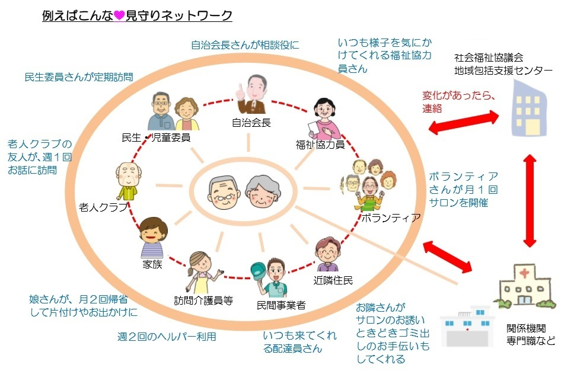

　民生委員・児童委員は、社会奉仕の精神をもって地域の福祉向上に取り組むボランティアです。

　民生委員・児童委員は、「住民の立場に立った相談・支援者」であり、自らも地域住民の一員として、担当の区域において高齢者や障害者の安否確認や見守り、子どもたちへの声かけなどを行っています。医療や介護の悩み、失業や経済的困窮による生活上の心配ごとなど、様々な相談に応じます(民生委員・児童委員には守秘義務があり、相談内容の秘密は守られます)。そして、相談内容に応じて、必要な支援が受けられるよう、行政をはじめ地域の専門機関との「つなぎ役」になっています。

## 地域福祉について
　地域福祉とは、それぞれの地域において人びとが安心して暮せるよう、地域住民や公私の社会福祉関係者が互いに強力して地域社会の福祉課題の解決に取り組む考え方です。
 
　少子高齢化、核家族化の進展の中で、不安を抱える人、何らかの支援を必要とする人が増えています。住み慣れた地域で誰もが安心して暮せるよう、地域での見守り、声掛け、手助け等の助け合いや、地域社会の問題解決に向けた活動が重要となっています。
 
　地域福祉は、制度化された福祉サービスや事業のみによって実現するものではなく、地域住民やボランティア、行政・関係諸機関、社会福祉関係者が協働して実践することによって支えられています。

## 見守りネットワーク

　見守りネットワークとは、地域住民、民間事業者、専門機関等さまざまな主体が、それぞれの立場や役割において見守りを行い、相互に連携しながら活動を実施することで、誰もが安心して暮らし続けられる体制が構築されている状況のことをいいます。
 
　地域で暮らす誰もが、同じ立場で、互いに助け合う関係性の中で、見守りが行われることが何より大切です。それが、共に支え合いながら、安心していつまでも住み続けることのできる地域社会の再生、すなわち、地域包括ケアシステムの構築へとつながります。

## 地域の支え合い活動

　既に支え合い活動が活発に行われている先進地の様子を参考にさせて頂きながら、安心していつまでも住み続けることのできる社会を共に作って参りましょう。

|参考資料Link（松本市のWebサイト）　活動事例の掲載あり|
|----|
| [地域の支え合い活動支援ガイド(スマートフォン用)](https://www.city.matsumoto.nagano.jp/smph/kenko/fukushi_hiroba/95029720180724125511287.html)|
| [地域の支え合い活動支援ガイド](https://www.city.matsumoto.nagano.jp/kenko/fukushi_hiroba/95029720180724125511287.html)|

## 災害に備える

　近年、これまで災害が発生しないと思われてきた地域においても災害が発生しており、住民の防災に対する意識が高まるとともに、地域のつながりの必要性もあらためて認識されるようになってきました。
 
　防災・減災をきっかけとすることで、近隣の助け合い活動や見守り活動に対する住民の関心や参加が促進されます。
平常時から近隣住民が相互に協力しあえる環境を整えておくために、防災訓練や避難訓練を積極的に行っておくことで、社会的孤立の防止にもつながります。
 
　また、今後「福祉マップ作り」などの新たな取り組みを一緒になって担っていくことが、行政や地域の関係機関・団体との連携を強化していくうえで欠かせないものと認識しています。
#### 参考サイト(外部リンク)
[災害に備える民生委員・児童委員活動に関する指針（全国民生委員児童委員連合会）](https://www2.shakyo.or.jp/wp-content/uploads/2019/03/c5584275301e95dd9de71a2ec85ebbf6.pdf)

[災害時住民支え合いマップの策定について（長野県）](https://www.pref.nagano.lg.jp/chiiki-fukushi/kenko/fukushi/fukushi/sasaeai.html)

#### 福祉マップ作成に役立つツールの紹介（外部リンク）

[OpenStreetMap Japan 自由な地図をみんなの手に](https://openstreetmap.jp/node/762)

[はじめてからのOpenStreetMapガイド](https://learnosm.org/ja/)

- [［OSM］地図を切り出して印刷する方法](https://medium.com/openstreetmap-tips-japan/)
- [Yahoo! Open Local Platform（YOLP）](https://map.yahoo.co.jp/promo/yolp/about.html)
- [OpenStreetMap 関連勉強会のページ](http://www.yamasita.jp/osm/seminar/)
- [OpenStreetMap 操作マニュアル PDF](https://www.okuminavi.jp/access/pdf/OpenStreetMap_manyuaru.pdf)
- [JOSM 操作マニュアル PDF](http://www.yamasita.jp/osm/seminar/140621_KyotoPrefecturalLibrary/JOSM_manual_0929.pdf)

[地図を手軽に作成！ Mappin' Drop](https://www.pasco.co.jp/MappinDrop/)

#### 一般的なGISの使い方（外部リンク）
- [地域づくりに地図やGISを使おう（国土交通省）pdf](http://www.mlit.go.jp/common/001035477.pdf)
- [GIS人材育成の資料：GISを使おう、研修手引き（国土交通省） PDF](http://www.mlit.go.jp/common/001037721.pdf)

 #### [【参考】QGIS（フリーソフト）紹介](https://qgis.org/ja/site/)

 [QGISマニュアル](https://qgis.org/ja/docs/index.html)
